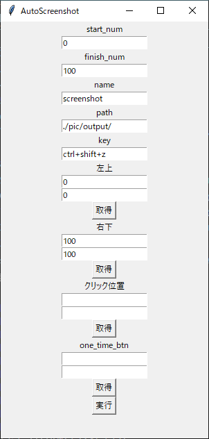

# Auto_Pic
- finish_num-start_numを引いた枚数分写真を撮影します。
## 動作確認済み環境
- Python  3.10.11
- Windows 10
## 使用方法
- start_num:開始番号
- finish_num:終了番号
- ファイル名は、[name]_[num].pngになります。
  - name:name欄に記入した名前
  - num :撮影された写真番号。 
    start_num <= num < finish_num
- path:ファイルの保存先を指定します。絶対パス、相対パスが可能です。
- key:強制終了する際のkeyです。
  - ☢☢撮影予定のアプリ等に指定されたキーに設定すると、そちらのアプリが優先されます。☢☢
  - 本番利用をする前に一度keyが動くか確認してください。
- 左上:撮影範囲を指定します。撮影範囲の最も左上に来る場所を指定してください。
  - マウスポインタを指定する位置に移動し、「s」キーを押してください。
- 右上:撮影範囲を指定します。撮影範囲の最も右上に来る場所を指定してください。
- クリック位置
  - 写真を1枚とるごとに指定の場所をクリックします。
  - ☢☢クリックするため、マウス操作が一時的に奪われてしまいます。強制終了する場合はkeyで指定したコマンドを3秒程度押してください。☢☢
- one_time_btn:スタート時、一度のみクリックします
  - 全画面にする場合などに利用してください
## デフォルトの値の変更
config.jsonファイルにデフォルトの値が指定してあります。適宜必要なものに変更してください。

## 発生中のエラー
- 取得ボタンを押した後に、しばらく放置、もしくはwindowを動かそうとした場合に、アプリケーション自体が反応しなくなってしまう問題。

## 今後の展望
1. エラーメッセージの表示
2. GUIによるデフォルト値の変更